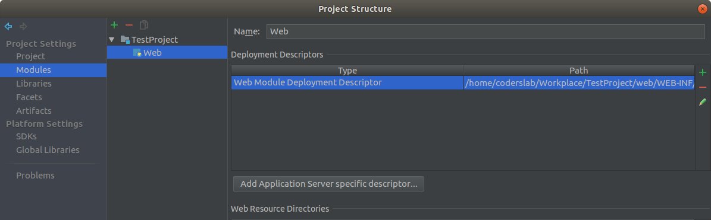
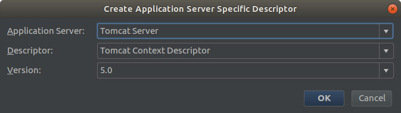
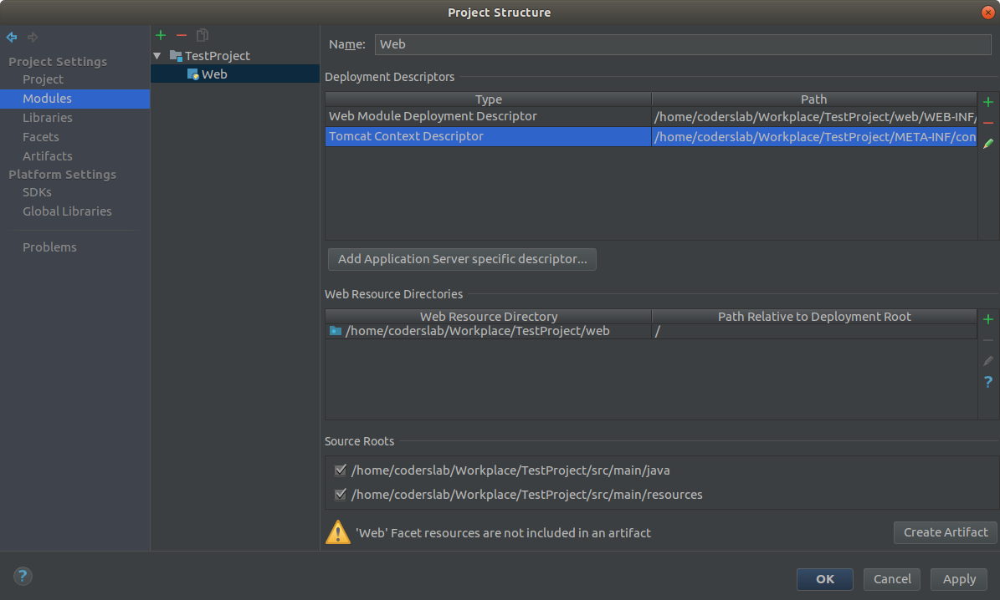

# ScrumLab

## Czym jest ScrumLab?

ScrumLab to projekt, którego celem jest nauczenie Cię pracy w zespole programistów.  Symuluje on realne zadania
w projekcie aplikacji webowej. Podczas tego tygodnia będziesz uczestniczyć w codziennych spotkaniach, rozwiązywać
problemy, robić *code review* i integrować swój kod z kodem kolegów.

ScrumLab będzie prowadzony inaczej niż pozostałe zajęcia w CodersLab. Udział wykładowcy powinien być tu jak najmniejszy, idealnie byłoby, gdyby zjawiał się tylko aby sprawdzić postępy - na tych zajęciach szlifujemy umiejętności dzielenia się wiedzą między uczestnikami i jednoczesną pracę nad wspólnym kodem.
Dodatkowo praca z repozytorium ma przypominać prawdziwy projekt — dlatego będzie się różnić od tego, jak wyglądała praca na ćwiczeniach. 

## Jak zacząć?

1. Sklonuj repozytorium na swój komputer. Użyj do tego komendy `git clone adres_repozytorium`
Adres repozytorium możesz znaleźć na stronie repozytorium po naciśnięciu w guzik "Clone or download".
2. Stwórz branch na zadanie, które będziesz rozwiązywał. Użyj do tego komendy: `git checkout -b nr-zadania/opis`.
Na przykład: `git checkout -b zadanie2.1/menu-boczne`
3. Rozwiąż zadanie i skomituj zmiany do repozytorium. Użyj do tego komend `git add nazwa_pliku`.
Jeżeli chcesz dodać wszystkie zmienione pliki użyj `git add .`
Pamiętaj że kropka na końcu jest ważna!
Następnie skommituj zmiany komendą `git commit -m "nazwa_commita"`
4. Wypchnij zmiany do repozytorium na GitHubie.  Użyj do tego komendy `git push origin main`
5. Stwórz [*pull request*](https://help.github.com/articles/creating-a-pull-request) gdy skończysz zadanie.
Jako `base` ustaw branch `main`, jako `compare` ustaw branch, który stworzyłeś w puncie `2`.
6. Jeśli Twoje zmiany zostaną zaakceptowane przez resztę zespołu, wykonaj merge dołączając swoje zmiany
do brancha `main`. Rozwiąż konflikty, jeśli zajdzie taka potrzeba.
7. Powtarzaj punkty od `2` do `6`, aż wykonasz wszystkie zaplanowane zadania.

### Przygotowanie – pliki css/js.

Pliki **css** możemy umieścić w katalogu 
````src/main/webapp/css````
przy powyższej lokalizacji w plikach szablonów załączamy je w następujący sposób:
````
  <link href='<c:url value="/css/style.css"/>' rel="stylesheet" type="text/css">
```` 
Jako przykład został dołączony servlet `HomeServlet` wskazujący home.jsp, dla którego wyświetla się poprawny szablon strony głównej.

### Dane do połączenia z bazą:

Plik znajduje się w naszym projekcie w katalogu **src/main/webapp/META-INF**.

`Zmodyfikuj znajdujące się w nim dane dotyczące połączenia.`

### W przypadku wystąpienia błędu:
````
javax.naming.NameNotFoundException: Name [jdbc/scrumlab] is not bound in this Context. Unable to find [jdbc].
````
wykonujemy następujące kroki:

Wybierz z górnego menu File –> Project Structure...

W okienku, które się pojawi, kliknij z lewej strony w Facets następnie **Web**.

Pojawi się okno, w którym kliknij **Add Application Server specific descriptor...**.



Wybierz z listy serwer **Tomcat** i zaakceptuj przyciskiem **OK**.



Na liście pojawi się plik **Tomcat Context Descriptor**. Potwierdź przyciskiem **OK**.



Plik znajduje się w naszym projekcie w katalogu **src/main/webapp/META-INF**.

`Zmodyfikuj znajdujące się w nim dane dotyczące połączenia.`

